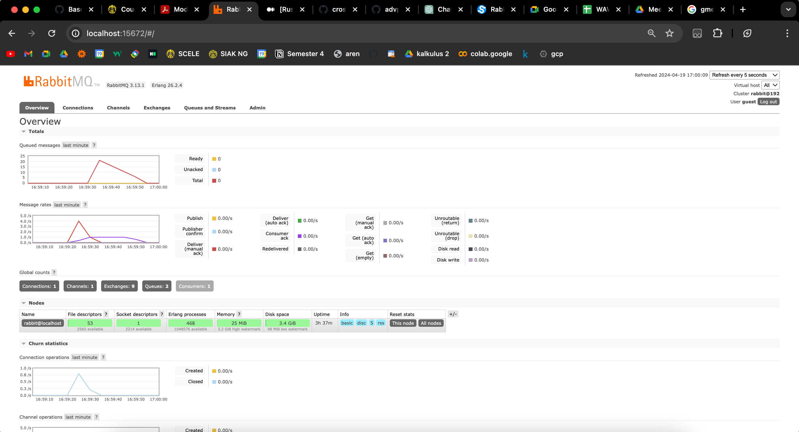
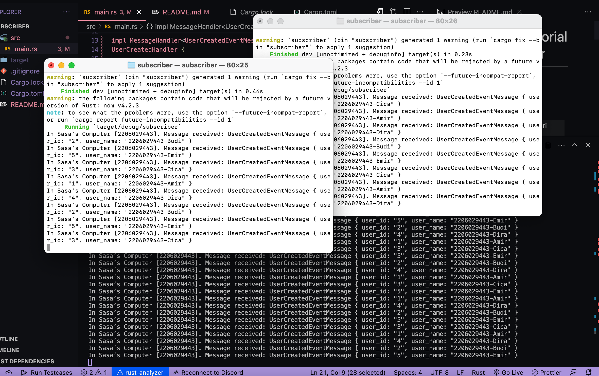

# Reflection Tutorial 8 - Subscriber
Syazantri Salsabila - 2206029443 - AdvPro B

a. what is amqp? 
> AMQP itu singkatan dari Advanced Message Queuing Protocol, biasa digunakan untuk passing message antar aplikasi atau komponen secara asinkronus (menjadi message broker). Di dalam kode ini, amqp melakukan initialize listener , lalu memanggilnya (```listener.listen```) untuk me-listen message dan terus looping me-listen messagenya. <br>

<br>

b. what it means? guest:guest@localhost:5672 , what is the first guest, and what is the second guest, and what is localhost:5672 is for?  
> ```guest:guest@localhost:5672``` adalah sebuah string berformat URL yang digunakan sebagai spesifikasi detail connection untuk AMQP yang digunakan. Lalu guest yang pertama maksudnya adalah username, sedangkan guest yang kedua maksudnya adalah password. Pada bagian```localhost:5672```, maksudnya adalah localhost sebagai hostname/ip address tempat AMQP dijalankan, sedangkan 5672 merupakan port tempat AMQP berkomunikasi (me-listen).

<br>

c. Simulation slow subscriber.

Dapat dilihat pada grafik, queued messages nya mencapai 20. Saat itu saya menjalankan publisher 5 kali dalam waktu yang cepat. Itu artinya terdapat 20 messages dalam antrian yang menunggu diiconsume. Hal ini bisa terjadi karena ada sleep dan saya menjalankan publisher sebanyak 5 kali secara cepat.

<br>

d. Reflection and Running at least three subscribers.


Gambar pertama menunjukkan saya menjalankan subscriber dalam 3 console. gambar kedua menunjukkan grafik pada RabbitMQ yang terlihat berbeda dari ketika saat menjalankan subscriber hanya pada 1 console. Dapat terlihat bahwa queued messages nya sekarang hanya belasan, padahal yang saya lakukan sama yaitu menjalankan publisher 5 kali dalam waktu cepat. Hal ini bisa terjadi karena message diconsume secara parallel oleh 3 subscriber (secara concurrently) sehingga mempercepat proses konsumsi dan queued messagenya jadi lebih sedikit.